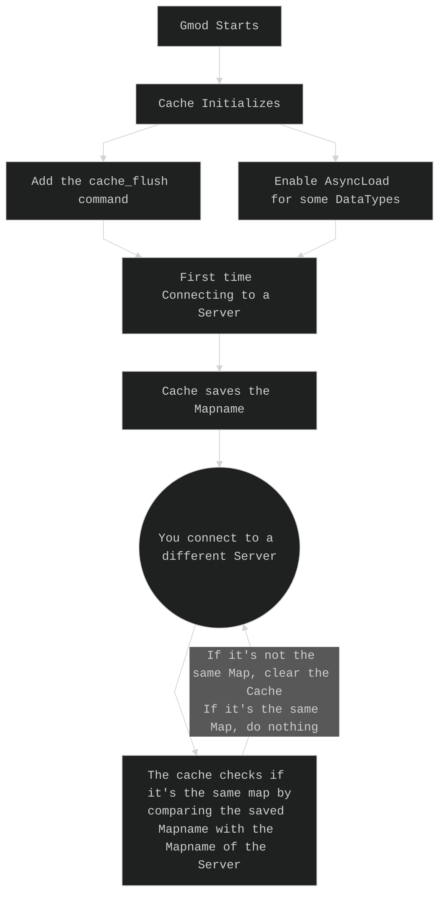

This Project clears the Model Cache when disconnecting from a server, only the main branch of Gmod is supported.  
It also activates Async Load for some DataTypes. (`MDLCACHE_STUDIOHWDATA`, `MDLCACHE_VCOLLIDE` and `MDLCACHE_VERTEXES`)

Note: This Project uses [Garry's Mod Common](https://github.com/danielga/garrysmod_common)

## How to Install
1. You need to download the `gmsv_clearcache_win32.dll` from the latest [release](https://github.com/RaphaelIT7/gmod-clearcache/releases)  
2. Move the `gmsv_clearcache_win32.dll` into your `garrysmod/lua/bin` folder.
3. You need insert

Windows:
```lua
if file.Exists("lua/bin/gmsv_clearcache_win32.dll", "GAME") then
  require("clearcache")
end
```

Linux:
```lua
if file.Exists("lua/bin/gmsv_clearcache_linux.dll", "GAME") then
  require("clearcache")
end
```

Into the `garrysmod/lua/menu/menu.lua` file at the bottom.

Note: If you change your Gmod branch or an update is made, your changes could get removed.

## How it currently works.
You can use the `cache_flush` command to manually flush the cache if it somehow didn't flush it itself, or if you just want to clear the cache completely.   
This command only works when you're not connected to a Server!  
NOTE: This command will flush some data that is not cleared automatically like `MDLCACHE_FLUSH_STUDIOHDR` or `MDLCACHE_FLUSH_VCOLLIDE` data because flushing them while joining a Server can cause some unexpected crashes or bugs like some Models having no collisions.  
(If you want to know what exactly crashes, `vphysics.dll` and `datacache.dll` are the ones crashing)


